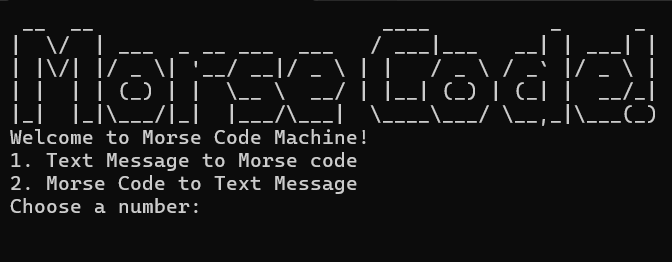

# Morse Code Interpreter


A Python application that translates English text into Morse code
and decodes Morse code back into text.

## Features
- Convert text to Morse code
- Convert Morse code to text
- Supports:
  - Letters
  - Numbers
  - Common punctuation
- Handles invalid Morse code gracefully
- Cross-platform screen clearing

## Technologies
- Python 3
- Standard Library (`os`, `subprocess`)

## Concepts Practiced
- Dictionary comprehensions
- Dictionary lookups
- Input validation
- Error handling

## How to Run
```bash
python main.py
```